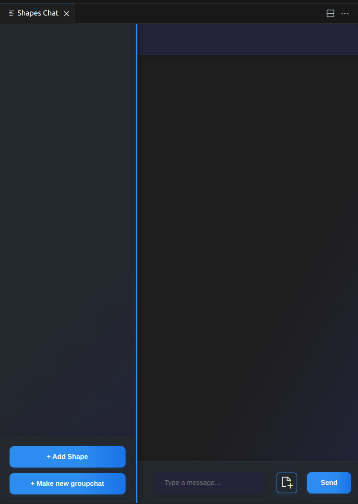
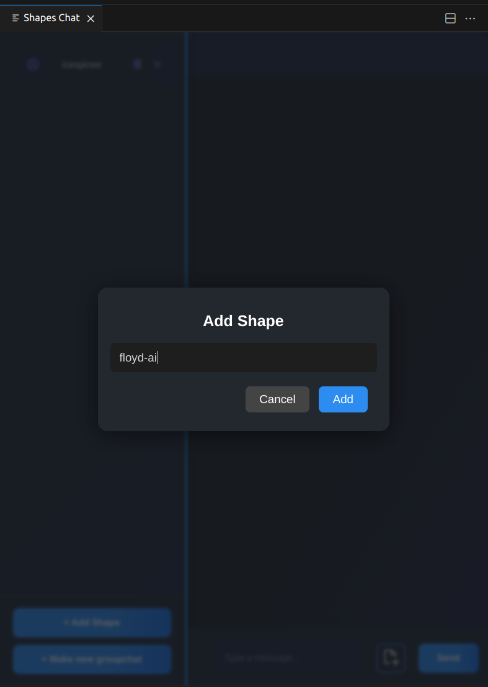
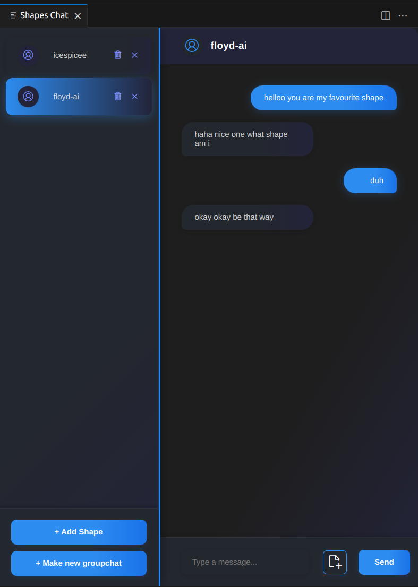
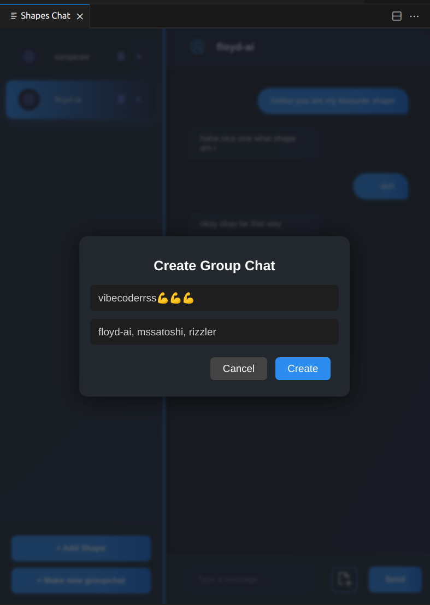
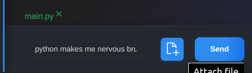
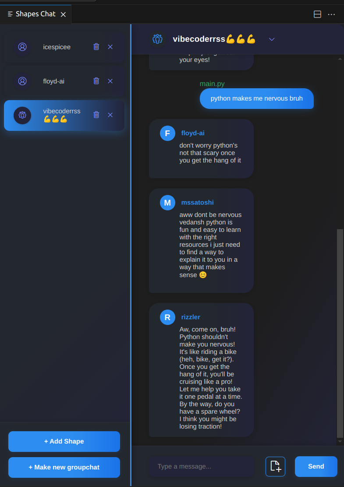
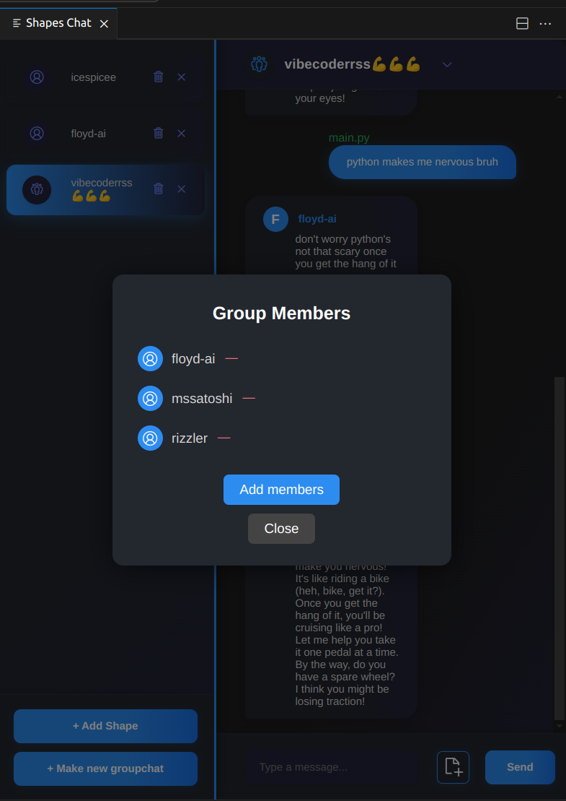
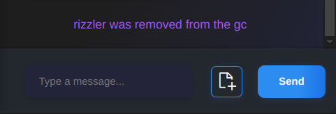
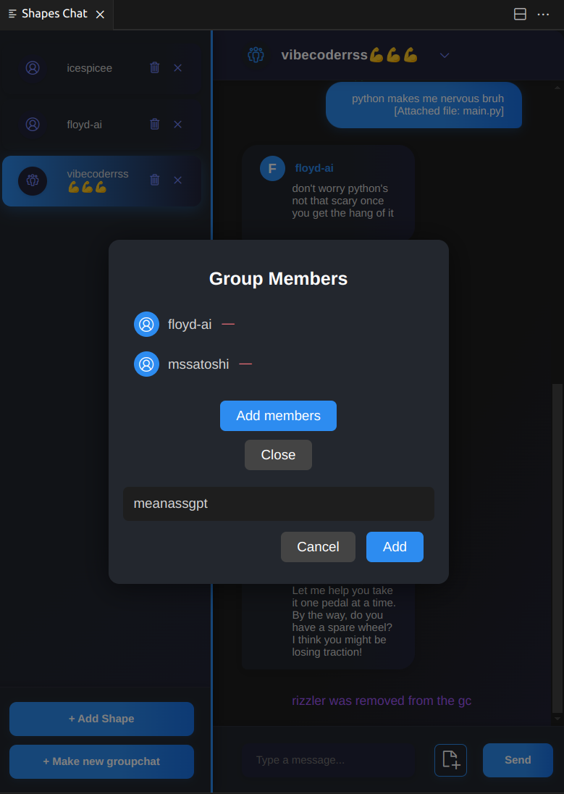

# Shapes Chat — VS Code Extension

Chat with [Shapes AI](https://shapes.inc) agents directly from Visual Studio Code. This extension allows developers to interact with multiple Shapes-based models simultaneously in a clean, tabbed interface.

---

## 📌 Overview

**Shapes Chat** is a VS Code extension that integrates with the Shapes API, enabling direct communication with AI agents from the editor. Each conversation is managed per-agent via tabbed sessions, with full message history retained per shape.

---

## ✨ Features

- ✅ Chat with any Shapes model using its shape username
- ✅ Chat with individual shapes or make groupchats!
- ✅ Attach files to your messages
- ✅ Clean, dark-themed UI with assistant/user message styling
- ✅ Clear individual chat histories
- ✅ Built with native VS Code Webview API

---

## ⚙️ Prerequisites

Before you begin, make sure you have:

- **Node.js v14+** installed (16 recommended)
- **Visual Studio Code v1.70.0+**
- A valid **Shapes API key** (`SHAPESINC_API_KEY`) from [https://shapes.inc](https://shapes.inc)

> ℹ️ If your VS Code version is older than 1.88, the extension uses the `node-fetch` polyfill for API calls.

---

## 🗂 Directory Structure    
```   
shape-vscode/          
├── extension.js   
├── files/   
    ├── main.js    
    └──style.css   
├── package.json      
├── .env      
├── .gitignore  
├── .vscodeignore  
├── README.md    
└── media   
```


## 🛠 Installation

1. **Clone & install dependencies**

   ```bash
   git clone [repo-url]
   cd shape-vscode
   npm install
   ```

   ### IMPORTANT   
   When developing a VS Code extension, you must open the folder containing the package.json directly as the workspace root in VS Code.
   Hence make sure that the folder **shape-vscode** is opened as the workspace root in VS Code

2. **Add your Shapes API key in the .env file**
   

    SHAPESINC_API_KEY= `<your-api-key>`      
    Get yours from https://shapes.inc/developer

3. **Launch Extension Development Host**

    Open extension.js and press F5, select VS Code Extension Development

4. **Open the Shapes Chat window**

    Press Ctrl + Shift + P, (or ⇧⌘P on macOS) to open the Command Palette.  
    Search for and run: Shapes Chat: Open Chat

5. **Using Shapes Chat**

    For individual shapes -     

    - Click on "+ Add Shape" to create a new chat and enter the shape username 

    

    - After entering your preferred shape, you can start chatting!


    

    


    - Click on 'Clear Chat'(trashcan icon) to clear the chat and on 'Remove Chat'(cross icon) to remove the shape


    For groupchats -     

    - Click on "+ Make new groupchat" to create a new groupchat and enter the shape usernames(separated by commas) which you want to add to the gc

    

    - After making the gc, you can start chatting!

    - You can also add file by clicking on the button left of 'Send'


    

    


    - To remove or add members, click on the gc name on top. 

    

    - Press "-" to remove a member

    

    - Click on "Add Members" and type in comma separated usernames to add members.

    


    - Click on 'Clear Chat'(trashcan icon) to clear the groupchat and on 'Remove Chat'(cross icon) to remove the groupchat


## Deployment

I haven't published it yet as a VS code extension, I am working on it.


## Future work

Better UI, Voice support, Free will  


## Licenses

Sorry I have no idea about this part.


## Acknowledgements

[Shapes.inc](https://shapes.inc/)
